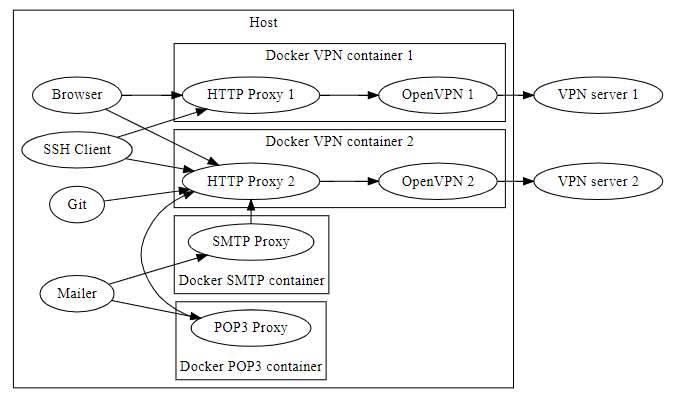

# Docker VPN HTTP Proxy
複数のVPN接続を行なうためのDockerコンテナ

## 動作原理

* Dockerコンテナ内でVPN接続
    * OpenVPN を使用
* Dockerコンテナ内で起動しているHTTPプロキシ経由でアクセス
    * ※ プロキシサーバーは `docker-compose up` で自動起動
    * コンテナ内で動作するプロキシのため、VPNへのアクセスが可能
    * （オプション）メール(POP3,SMTP)プロキシサーバー経由でメール送受信も可能
* 1コンテナ 1VPN 1proxyのため、接続するVPNごとに実行

## 使い方
1. docker, docker-compose をインストール
1. 接続したいVPNの数だけ以下を繰り返す
    1. このフォルダを複製（ `git clone`, `cp`, etc）
    1. 環境変数設定
        * `cp .env.sample .env`
        * `.env` ファイルを編集（詳細は後述）
    1. `vpn-config` フォルダに `.ovpn` 拡張子のOpenVPN用設定ファイルを配置
        * ファイル名は自由（`.ovpn` 拡張子で検索する）
        * フォルダ内に1つの `.ovpn` 拡張子のみ可
    1. `docker-compose up -d`
    1. `.env` で設定したプロキシ `<IP>:<PORT>` をブラウザやOSのプロキシ設定に登録
        * おすすめ：`proxy.pac` を使用
            * 複数VPNを同時利用する場合は必須
            * サンプル: [doc/sample.proxy.pac](./doc/sample.proxy.pac)
        * メール(POP3,SMTP)プロキシを使う場合はメーラーの設定を変更（`設定値` 参照）
    1. VPN接続用scriptを実行
        - `connect-vpn-windows.bat`
            - Windows用
        - `connect-vpn-windows.bash`
            - Windows用（キーボードショートカットでクリップボードを貼り付けたい場合）
            - Git Bash(MinTTY) などに関連付けして使う
        - `connect-vpn-linux.sh`
            - Linux用

### 設定値 (`.env` ファイル)
* `key=value` 形式
    * ※ `=` 前後には空白無し
* `#` 始まりはコメント行

#### `http_proxy`, `https_proxy`
インターネットアクセスにプロキシの設定が必要ならコメントアウトを外してアドレス:PORTを編集

```
# http_proxy=http://proxy.example.com:8080
# https_proxy=http://proxy.example.com:8080
```

Docker image build 時の `openvpn` & `squid` インストールに使用

※ すでに環境変数にセットされているならこのファイルでのセットは不要

#### `PROXY_BIND_IP_PORT`
コンテナ内のproxyのbindをhost側につなげる際のhost側の待ち受けIP:PORT
```
PROXY_BIND_IP_PORT=127.0.0.1:18080
```
※ Docker Toolbox (VirtualBox) を使っている場合は、コンテナの待ち受けIPを `0.0.0.0` として、ブラウザに設定するプロキシは、VMのIPにする必要がある（VMのIPは以下のコマンド確認可能）。
```
docker-machine ip
```

#### `COMPOSE_FILE`
メール(POP3,SMTP)プロキシサーバーも起動するかの切り替えに使用

* メール(POP3,SMTP)プロキシサーバー無し
    ```
    COMPOSE_FILE=docker-compose.yml
    ```
* メール(POP3,SMTP)プロキシサーバー有り
    ```
    COMPOSE_FILE=docker-compose.yml;docker-compose.mail.yml
    ```

#### `POP3_BIND_IP_PORT`
コンテナ内のPOP3プロキシサーバーのbindをhost側につなげる際のhost側の待ち受けIP:PORT
```
POP3_BIND_IP_PORT=127.0.0.1:10110
```
メーラーの設定を上記 `POP3_BIND_IP_PORT` の `IP:PORT` に変更する

#### `POP3_PROXY_TARGET`
POP3(TCP)パケットを転送する先のIP(host):PORT
```
POP3_PROXY_TARGET=example.com:110
```
メーラーにもともと設定してあったIP(host):PORT

#### `SMTP_BIND_IP_PORT`
コンテナ内のSMTPプロキシサーバーのbindをhost側につなげる際のhost側の待ち受けIP:PORT
```
SMTP_BIND_IP_PORT=127.0.0.1:10025
```
メーラーの設定を上記 `SMTP_BIND_IP_PORT` の `IP:PORT` に変更する

#### `SMTP_PROXY_TARGET`
SMTP(TCP)パケットを転送する先のIP(host):PORT
```
SMTP_PROXY_TARGET=example.com:25
```
メーラーにもともと設定してあったIP(host):PORT

## Tips
### OpenVPN にプロキシを使わせる方法
`vpn-config` フォルダに配置した設定ファイル（`.ovpn` 拡張子）に以下のプロキシ設定を追加
```
http-proxy <proxy_fqdn> <proxy_port>
```
例
```
http-proxy proxy.example.com 8080
```

### OpenVPN でのログイン時にUser IDの入力を省略する方法
1. `vpn-config` フォルダに `user.txt` ファイルを作成
1. `user.txt` ファイルの1行目にUser IDを記述
1. `vpn-config` フォルダに配置した設定ファイル（`.ovpn` 拡張子）に以下の認証設定を追加
    ```
    auth-user-pass /etc/vpn-config/user.txt
    ```
    * ※ すでに、 `auth-user-pass` 行が存在する場合は置き換え

### SSH・Git(SSH)でコンテナ内のプロキシを経由する方法
SSH config ( `~/.ssh/config` ) に `ProxyCommand` を追加

```
Host server1
    HostName         10.12.34.56
    IdentityFile     ~/.ssh/keys/server1
    ProxyCommand     connect.exe -H 127.0.0.1:18080 %h %p
```

`connect.exe` は `-H` オプションでプロキシサーバーを指定する
```
ProxyCommand     connect.exe -H <proxy-server-ip>:<proxy-server-port> %h %p
```
参照: `.env` の `PROXY_BIND_IP_PORT` 設定

※ Gitもsshで接続している場合は同じ方法で可能

## よくある質問
### VPNログインできない（`connect-vpn-windows.bat` などが即座に閉じる）
#### 発生例
* PC再起動後
    * `restart: always` にしてあり自動起動するが、正常起動しない場合あり
* Docker更新後
    * ボリューム共有がリセットされてOpenVPN用設定ファイル( `vpn-config` フォルダの `.ovpn` )が共有されていない場合あり
#### 対応
dockerコンテナの再起動
```
docker-compose restart
```
上記対応で解決されない場合は、コンテナの再作成
```
docker-compose up -d --force-recreate
```

### VPN接続用script ウィンドウが勝手に閉じる
#### 原因
* ログイン時
    * User ID & Password が間違っている
* ログイン成功後
    * VPN接続の切断（ネットワークやサーバー側の問題など）
#### 対応
再ログイン


## 既知の問題
### VPN側のIPがDockerで使われているネットワークのIPアドレス範囲に含まれていると対象IPのVPN側サーバーと通信できない
### 例）コンテナ内ネットワーク

確認コマンド
```
docker-compose exec -T vpn sh -c 'ip -f inet addr'
```
出力（例）
```
1: lo: <LOOPBACK,UP,LOWER_UP> mtu 65536 qdisc noqueue state UNKNOWN group default qlen 1
    inet 127.0.0.1/8 scope host lo
       valid_lft forever preferred_lft forever
46: eth0@if47: <BROADCAST,MULTICAST,UP,LOWER_UP> mtu 1500 qdisc noqueue state UP group default  link-netnsid 0
    inet 172.18.0.2/16 scope global eth0
       valid_lft forever preferred_lft forever
```
この場合、 `172.18.0.2/16` にVPN側のIPが含まれていると通信できない
