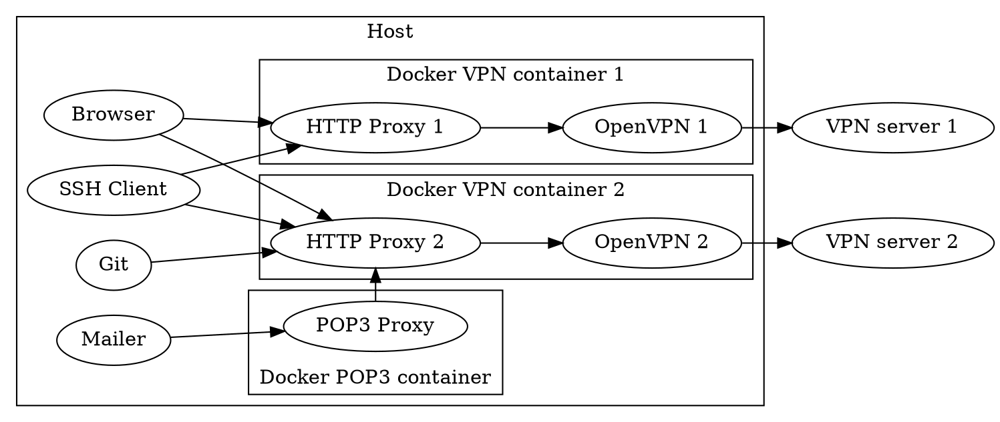

```graphviz
digraph configuration_diagram {
    rankdir = LR
    "OpenVPN 1" -> "VPN server 1";
    "OpenVPN 2" -> "VPN server 2";
    subgraph cluster_host {
        rank_dir = same;
        label = "Host";
        Browser -> "HTTP Proxy 1";
        Browser -> "HTTP Proxy 2";
        "SSH Client" -> "HTTP Proxy 1";
        "SSH Client" -> "HTTP Proxy 2";
        Git -> "HTTP Proxy 2";
        Mailer -> "POP3 Proxy";
        subgraph cluster_container_1 {
            label = "Docker VPN container 1";
            "HTTP Proxy 1" -> "OpenVPN 1";
        }
        subgraph cluster_container_2 {
            label = "Docker VPN container 2";
            "HTTP Proxy 2" -> "OpenVPN 2";
        }
        subgraph cluster_container_2_pop3 {
            label = "Docker POP3 container";
            labelloc = b;
            "POP3 Proxy" -> "HTTP Proxy 2";
        }
        newrank=true;
        {
            rank = same;
            "HTTP Proxy 1";
            "HTTP Proxy 2";
            "POP3 Proxy";
        }
    }
}
```
