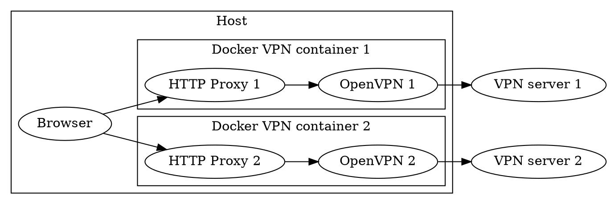

```graphviz
digraph configuration_diagram {
    rankdir = LR
    "OpenVPN 1" -> "VPN server 1";
    "OpenVPN 2" -> "VPN server 2";
    subgraph cluster_host {
        rank_dir = same;
        label = "Host";
        Browser -> "HTTP Proxy 1";
        Browser -> "HTTP Proxy 2";
        subgraph cluster_container_1 {
            label = "Docker VPN container 1";
            "HTTP Proxy 1" -> "OpenVPN 1";
        }
        subgraph cluster_container_2 {
            label = "Docker VPN container 2";
            "HTTP Proxy 2" -> "OpenVPN 2";
        }
    }
}
```
